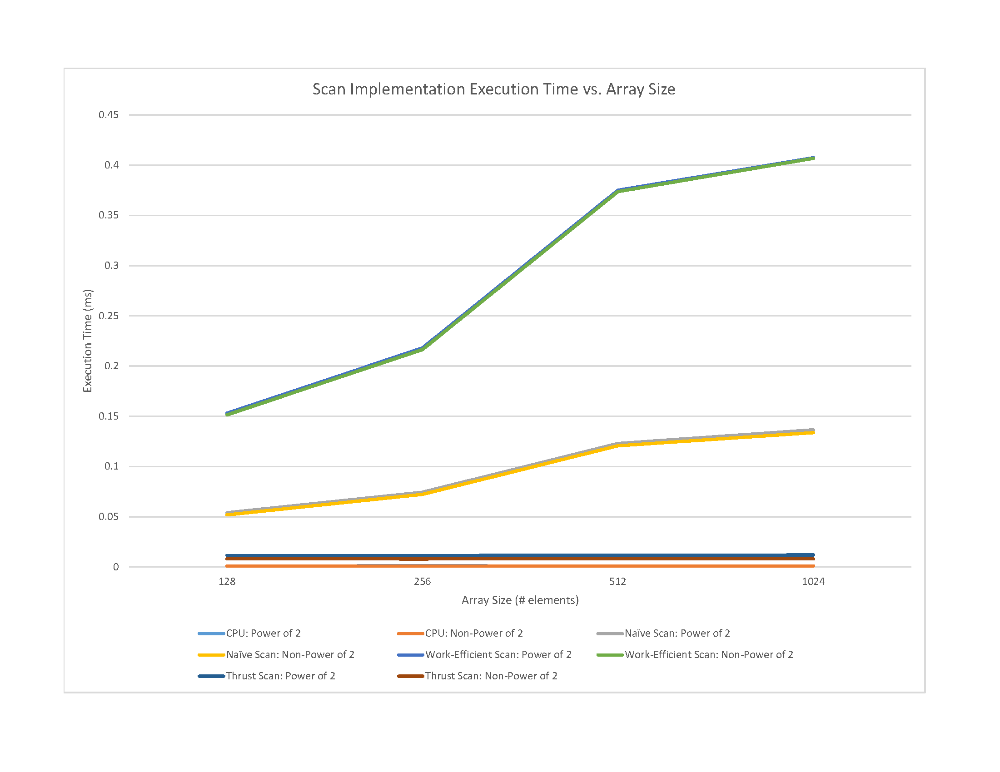

CUDA Stream Compaction
======================

**University of Pennsylvania, CIS 565: GPU Programming and Architecture, Project 2**

* Bradley Crusco
* Tested on: Windows 10, i7-3770K @ 3.50GHz 16GB, 2 x GTX 980 4096MB (Personal Computer)

### Description

This project is a series of scan and stream compression algorithms.
Features:
 * CPU Exclusive Prefix Sum Scan
 * CPU Stream Compaction Without Scan
 * CPU Stream Compaction using Exclusive Prefix Sum Scan
 * Naive GPU Exclusive Preflix Sum Scan
 * Work-Efficient GPU Exclusive Preflix Sum Scan
 * GPU Stream Compaction using Work-Efficient GPU Exclusive Prefix Sum Scan

### Performance Analysis

**Scan Implementation Execution Time vs. Array Size**

Unfortunately, the results from testing are not very impressive. The sequential CPU implementation easily out performs everything but the Thrust implementation, and the worst performer by far is the work-efficient implementation, which we'd expect to outperform the naive scan. So why is this? I am not 100% sure. However I had difficulty determining how to configure the grid and block size optimally, and as a result all the GPU implementations are using the same ratio, with 512 threads per block. A better understanding of how to configure this might result in performance more in line with what we'd expect to see.

The other possible cause may be that our arrays are not very large, with the maximum array I tested with being 1024. It could be the case that this wasn't enough data for the GPU to take advantage of and counteract the overhead of the parallel algorithm vs. the sequential and is ultimately bottlenecked by memory I/O

### Test Program Output (Array Size 256)

```
****************
** SCAN TESTS **
****************
    [   3  29  33  19   0  16  10  40  39  50  44  30   9 ...   4   0 ]
==== cpu scan, power-of-two ====
CPU execution time for scan: 0.00109ms
    [   0   3  32  65  84  84 100 110 150 189 239 283 313 ... 6684 6688 ]
==== cpu scan, non-power-of-two ====
CPU execution time for scan: 0.00106ms
    [   0   3  32  65  84  84 100 110 150 189 239 283 313 ... 6613 6626 ]
    passed
==== naive scan, power-of-two ====
CUDA execution time for naive scan: 0.07440ms
    passed
==== naive scan, non-power-of-two ====
CUDA execution time for naive scan: 0.07222ms
    passed
==== work-efficient scan, power-of-two ====
CUDA execution time for work efficient scan: 0.21798ms
    passed
==== work-efficient scan, non-power-of-two ====
CUDA execution time for work efficient scan: 0.21632ms
    passed
==== thrust scan, power-of-two ====
    passed
==== thrust scan, non-power-of-two ====
    passed

*****************************
** STREAM COMPACTION TESTS **
*****************************
    [   4   3   0   3   4   2   3   2   3   1   1   1   4 ...   3   0 ]
==== cpu compact without scan, power-of-two ====
CPU execution time for compact without scan: 0.00106ms
    [   4   3   3   4   2   3   2   3   1   1   1   4   3 ...   3   3 ]
    passed
==== cpu compact without scan, non-power-of-two ====
CPU execution time for compact without scan: 0.00106ms
    [   4   3   3   4   2   3   2   3   1   1   1   4   3 ...   4   4 ]
    passed
==== cpu compact with scan ====
CPU execution time for compact with scan: 0.00109ms
    [   4   3   3   4   2   3   2   3   1   1   1   4   3 ...   3   3 ]
    passed
==== work-efficient compact, power-of-two ====
CUDA execution time for stream compaction: 0.22755ms
    passed
==== work-efficient compact, non-power-of-two ====
CUDA execution time for stream compaction: 0.22557ms
    passed
